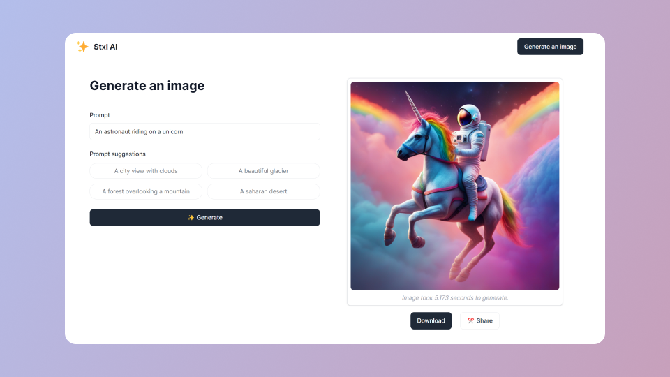

# Stxl AI

<a href="https://github.com/MaximilianHagelstam/ai-image-generator/actions">

</a>

### Demo

<a href="https://stxl-ai.vercel.app/">
  
</a>

### Getting started

1. Setup Azure Blob Storage and Replicate:

2. Install dependencies:

```bash
npm install
```

3. Create a `.env` file and fill it out as per `.env.example`:

```bash
cp .env.example .env
```

4. Start the development server:

```bash
npm run dev
```

### Built with

- [Nuxt](https://nuxt.com/)
- [Azure](https://azure.microsoft.com/en-us/products/storage/blobs)
- [Replicate](https://replicate.com/)
- [Tailwind CSS](https://tailwindcss.com/)
